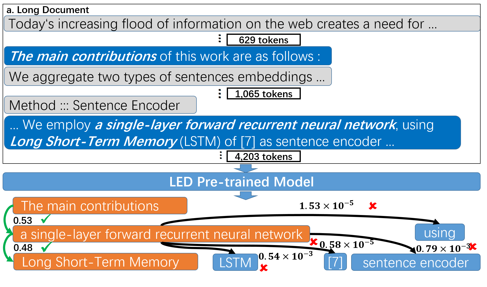
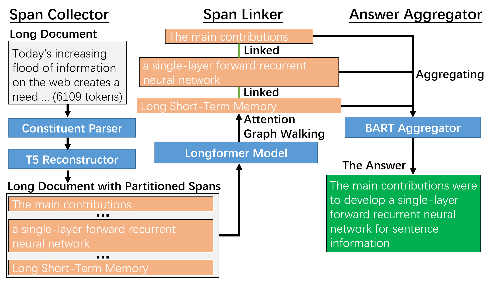

# Unsupervised-Long-Document-QA

This repository contains code and data for the paper: [AttenWalker: Unsupervised Long-Document Question Answering via Attention-based Graph Walking (ACL 2023 Findings)](https://arxiv.org/abs/2305.02235).

- We propose **AttenWalker**, a novel method which leverages a *data-centric* approach that automatically generates high-quality long-document QA pairs from the input documents without human supervision. It also employs an attention-based graph walking mechanism that enables long-range reasoning across multiple paragraphs and sentences. 

- Experiments on QASPER and NarrativeQA datasets demonstrate the effectiveness of our method.

## Introduction
AttenWalker is composed of three modules, i.e., span collector, span linker and answer aggregator. Firstly, the span collector takes advantage of constituent parsing and reconstruction loss to select informative candidate spans for constructing answers. Secondly, by going through the attention graph of a pre-trained long-document model, potentially interrelated text spans (that might be far apart) could be linked together via an attention-walking algorithm. Thirdly, in the answer aggregator, linked spans are aggregated into the final answer via the mask-filling ability of a pre-trained model.

<p align="center">

</p>

<p align="center">

</p>

## Requirements
- Python 3.7.13
- torch 1.10.1
- transformers 4.20.0
- allennlp 2.10.0
- allennlp-models 2.10.0
- benepar 0.2.0
- en-core-web-md 3.2.0
- nlg-eval 2.3
- nltk 3.7
- numpy 1.21.4
- overrides 4.1.2
- scikit-learn 1.0.2
- scipy 1.7.3
- datasets 2.6.1

## Data Preparation
Make the following data directories:  
```bash
mkdir -p ./data/Qasper
mkdir -p ./data/Narrativeqa
````

### QASPER
First, download the raw dataset of [Qasper](https://allenai.org/data/qasper). In our experiment, we use version **0.3** of Qasper.

```bash
QASPER_HOME=./data/Qasper
cd $QASPER_HOME
wget https://qasper-dataset.s3.us-west-2.amazonaws.com/qasper-train-dev-v0.2.tgz
wget https://qasper-dataset.s3.us-west-2.amazonaws.com/qasper-test-and-evaluator-v0.2.tgz
tar zxvf qasper-train-dev-v0.2.tgz
tar zxvf qasper-test-and-evaluator-v0.2.tgz
python retain_extr_abs_question.py
```

### NarrativeQA

We download NarrativeQA dataset and convert it into the QASPER format for convenience.
The follow commands are for NarrativeQA data preprocessing:
```bash
NARRATIVEQA_HOME=./data/NarrativeQA
cd $NARRATIVEQA_HOME
python convert_narrativeqa_into_qasper_format.py
```
Then you will have `narrativeqa-train.json`, `narrativeqa-dev.json` and `narrativeqa-test.json` in `$NARRATIVEQA_HOME`.


## Unsupervised QA Data Generation
The constructed QA datasets via the prosposed AttenWalker can be also found [here](https://drive.google.com/drive/folders/1uFtdRF_DZRGL0K1ukP8QzkXaSOv_cBFl?usp=sharing).
### QASPER
Run the following commands to generate QA pairs with documents in QASPER:
```bash
cd ./code
DEVICES=0,1
DEVICE=0
python generate_loop_QASPER.py ${DEVICES} 1-888 bart
python converge_and_sample_data.py ./ulqa_data_v2
cd qasper-led-baseline
./train_full_to_answer_ulqa_QASPER.sh ${DEVICE}
cd ..
python python generate_loop_QASPER_second_iteration.py ${DEVICES} 1-888 bart
python converge_and_sample_data.py ./ulqa_data_v3
cd qasper-led-baseline
./train_full_to_answer_ulqa_QASPER_second_iteration.sh ${DEVICE}
```

Then to evaluate the performance of the long-document QA model on the test set of QASPER, we can use:
```bash
cd code/qasper-led-baseline
DEVICE=0
eval_full_ulqa_QASPER.sh ${DEVICE}
```
The result score will be saved in `ulqa_test_QASPER.txt`.

### NarrativeQA
Similarly, we can generate data and train the long-document QA model via:
```bash
cd ./code
DEVICES=0,1
DEVICE=0
python generate_loop_NarrativeQA.py ${DEVICES} 1-3000 bart
python converge_and_sample_data_NarrativeQA.py ./ulqa_data_v2_NarrativeQA
cd qasper-led-baseline
./train_full_to_answer_ulqa_NarrativeQA.sh ${DEVICE}
cd ..
python python generate_loop_NarrativeQA_second_iteration.py ${DEVICES} 1-3000 bart
python converge_and_sample_data_NarrativeQA.py ./ulqa_data_v3_NarrativeQA
cd qasper-led-baseline
./train_full_to_answer_ulqa_NarrativeQA_second_iteration.sh ${DEVICE}
```

Then to evaluate the performance of the long-document QA model on the test set of NarrativeQA, we can use:
```bash
cd code/qasper-led-baseline
DEVICE=0
eval_full_ulqa_NarrativeQA.sh ${DEVICE}
```
The result score will be saved in `ulqa_test_NarrativeQA.txt`.

## Reference
Please cite the paper in the following format if you use our model or dataset during your research.

```bibtex
@article{nie2023attenwalker,
  title={AttenWalker: Unsupervised Long-Document Question Answering via Attention-based Graph Walking},
  author={Nie, Yuxiang and Huang, Heyan and Wei, Wei and Mao, Xian-Ling},
  journal={arXiv preprint arXiv:2305.02235},
  year={2023}
}
```

## Q&A
If you encounter any problem, feel free to either directly contact the [first author](mailto:jerrrynie@gmail.com) or leave an issue in the Github repo.
